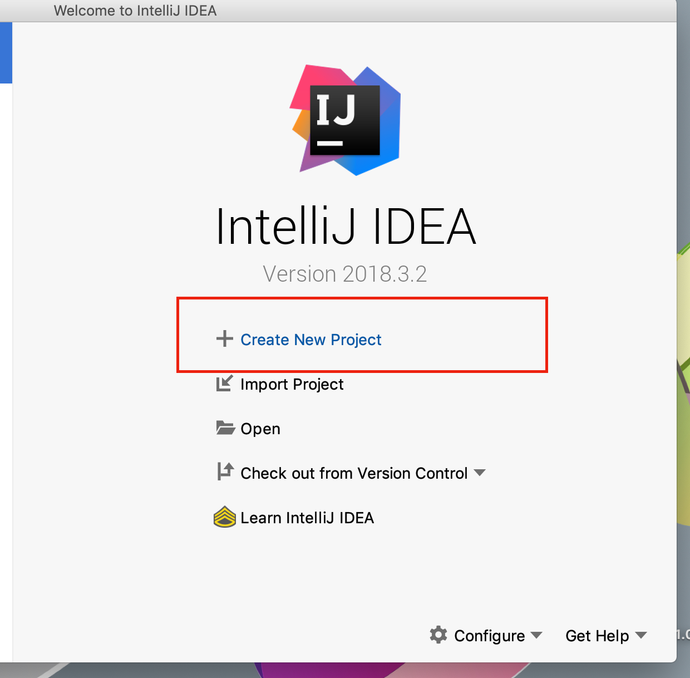
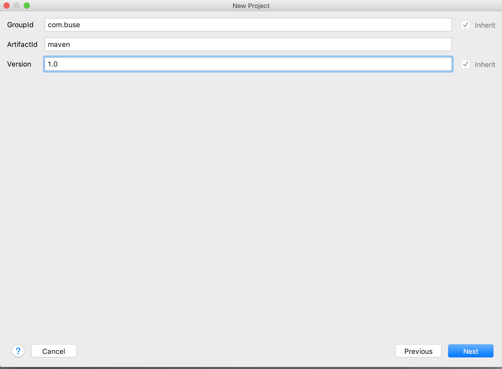
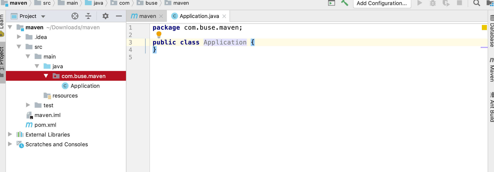

# Maven基本用法和概念

### 1. maven[下载](http://maven.apache.org/download.cgi)安装

下载好后解压文件，然后设置环境变量。

```shell
export PATH="${mavenDir}/bin:$PATH"
```

```shell
# 测试是否安装成功，这里会显示maven home，假设mavenDir代表此maven home
mvn -v
```

### 2. maven配置淘宝数据源

修改配置文件

```shell
cp ${mavenDir}/conf/settings.xml ~/.m2
vim settings.xml
```

```xml
<!-- 修改<mirrors><mirrors>为 -->
<mirrors>
    <mirror>
      <id>alimaven</id>
      <name>aliyun maven</name>
      <url>http://maven.aliyun.com/nexus/content/groups/public/</url>
      <mirrorOf>central</mirrorOf>        
    </mirror>
</mirrors>
```

###  3. 使用idea创建一个maven项目




创建完成后可以查看项目的结构



#### pom.xml文件解析

```xml
<?xml version="1.0" encoding="UTF-8"?>
<project xmlns="http://maven.apache.org/POM/4.0.0"
         xmlns:xsi="http://www.w3.org/2001/XMLSchema-instance"
         xsi:schemaLocation="http://maven.apache.org/POM/4.0.0 http://maven.apache.org/xsd/maven-4.0.0.xsd">
    <modelVersion>4.0.0</modelVersion>

    <groupId>com.buse</groupId>
    <artifactId>maven</artifactId>
    <version>1.0</version>

    <properties>
        <exec.mainVerticle>com.buse.maven.Application</exec.mainVerticle>

        <vertx.version>3.6.3</vertx.version>

        <maven-compiler-plugin.version>3.8.0</maven-compiler-plugin.version>
        <maven-shade-plugin.version>2.4.3</maven-shade-plugin.version>
        <exec-maven-plugin.version>1.5.0</exec-maven-plugin.version>
    </properties>

    <dependencies>
        <dependency>
            <groupId>io.vertx</groupId>
            <artifactId>vertx-core</artifactId>
            <version>${vertx.version}</version>
        </dependency>

        <dependency>
            <groupId>io.vertx</groupId>
            <artifactId>vertx-web</artifactId>
            <version>${vertx.version}</version>
        </dependency>
    </dependencies>

    <build>
        <pluginManagement>
            <plugins>
                <plugin>
                    <artifactId>maven-compiler-plugin</artifactId>
                    <version>${maven-compiler-plugin.version}</version>
                    <configuration>
                        <source>1.8</source>
                        <target>1.8</target>
                    </configuration>
                </plugin>
            </plugins>
        </pluginManagement>

        <plugins>
            <plugin>
                <groupId>org.apache.maven.plugins</groupId>
                <artifactId>maven-shade-plugin</artifactId>
                <version>${maven-shade-plugin.version}</version>
                <executions>
                    <execution>
                        <phase>package</phase>
                        <goals>
                            <goal>shade</goal>
                        </goals>
                        <configuration>
                            <transformers>
                                <transformer implementation="org.apache.maven.plugins.shade.resource.ManifestResourceTransformer">
                                    <manifestEntries>
                                        <Main-Class>io.vertx.core.Launcher</Main-Class>
                                        <Main-Verticle>${exec.mainVerticle}</Main-Verticle>
                                    </manifestEntries>
                                </transformer>
                                <transformer implementation="org.apache.maven.plugins.shade.resource.AppendingTransformer">
                                    <resource>META-INF/services/io.vertx.core.spi.VerticleFactory</resource>
                                </transformer>
                            </transformers>
                            <artifactSet>
                            </artifactSet>
                            <outputFile>${project.build.directory}/${project.artifactId}-${project.version}-fat.jar</outputFile>
                        </configuration>
                    </execution>
                </executions>
            </plugin>

            <plugin>
                <groupId>org.codehaus.mojo</groupId>
                <artifactId>exec-maven-plugin</artifactId>
                <version>${exec-maven-plugin.version}</version>
                <configuration>
                    <mainClass>io.vertx.core.Launcher</mainClass>
                    <arguments>
                        <argument>run</argument>
                        <argument>${exec.mainVerticle}</argument>
                    </arguments>
                </configuration>
            </plugin>
        </plugins>
    </build>

</project>
```

**说明**

##### 项目基本信息说明

`<groupId>`以前的为默认值，不需要修改。

* `groupId`指定项目所属的组
* `artifactId`指定了该项目在组中唯一的ID
* `version`指定了项目的版本

这些属性是用来唯一标识一个项目的。

##### `<dependencies>`讲解

`dependency`属性指明了项目依赖的第三方包

`groupId、artifactId、version`用来标明采用了哪些第三方包

`type`：指明依赖类型，一般不用指明，默认为`jar`

`scope`：依赖的范围

* `compile`：编译依赖范围。如果没有指定，就会默认使用该依赖范围。使用此依赖范围的Maven依赖，对于编译、测试、运行三种classpath都有效
* `test`：测试依赖范围。使用次依赖范围的Maven依赖，只对于测试classpath有效，在编译主代码或者运行项目的使用时将无法使用此依赖
* `provided`：已提供依赖范围。使用此依赖范围的Maven依赖，对于编译和测试classpath有效，但在运行时候无效。典型的例子是servlet-api,编译和测试项目的时候需要该依赖，但在运行项目的时候，由于容器以及提供，就不需要Maven重复地引入一遍
* `runtime`：运行时依赖范围。使用此依赖范围的Maven依赖，对于测试和运行classpath有效，但在编译主代码时无效

`exclusions`：排除依赖，去除掉引用的依赖包中引用的别的依赖

```xml
<dependency>
	<exclusions>
		<exclusion>
			<groupId>...</groupId>
			<artifactId>...</artifactId>
		</exclusion>
	</exclusions>
</dependency>
```

##### 归类依赖

有时候我们引入的很多依赖包，他们都来自同一个项目的不同模块，所以他们的版本号都一样，这时候我们可以用属性来统一管理版本号

```xml
<!-- 定义属性 -->
<properties>
	<vertx.version>3.6.3</vertx.version>
</properties>

<!-- 使用属性 -->
<dependency>
	<groupId>io.vertx</groupId>
	<artifactId>vertx-web</artifactId>
	<version>${vertx.version}</version>
</dependency>
```

### 4. pom.xml文件属性

我们可以在`pom.xml`文件中添加`<build>`标签，其中自定义我们的命令，命令可以使用的默认文件属性有如下这些

* `${project.build.sourceDirectory}`：项目的主源码目录，默认为`src/main/java/`
* `${project.build.testSourceDirectory}`：项目的测试源码目录，默认为`/src/test/java/`
* `{project.build.directory}`：项目构建输出目录，默认为`target/`
* `${project.build.outputDirectory}`：项目主代码编译输出目录，默认为`target/classes/`
* `${project.build.testOutputDirectory}`：项目测试代码编译输出目录，默认为`target/testclasses/`
* `${project.groupId}`：项目的`groupId`
* `${project.artifactId}`：项目的`artifactId`
* `${project.version}`：项目的`version`,与`${version}`等价
* `${project.build.finalName}`：项目打包输出文件的名称，默认为`${project.artifactId}​${project.version}`

### 5. maven常用命令

* `mvn clean`：表示运行清理操作（会默认把target文件夹中的数据清理）

  **后续命令可以不加clean**

* `mvn clean compile`：表示先运行清理之后运行编译，会将代码编译到target文件夹中

* `mvn clean test`：运行清理和测试

* `mvn clean package`：运行清理和打包，生成jar包
   `mvn clean package -Dmaven.test.skip=true`：打包时跳过单元测试

* `mvn clean install`：运行清理和安装，会将打好的包安装到本地仓库中，以便其他的项目可以调用

* `mvn clean deploy`：运行清理和发布（发布到私服上面）

### 6. 仓库

仓库可以用来存储管理项目中需要使用到的依赖

仓库有`本地仓库`、`中央仓库`、`其他公共仓库`和`私服`这些分类，其中后三者都为远程仓库

`本地仓库`：开发时电脑上存储jar包的位置，默认为`~/.m2/reporistory`。可以修改`~/.m2/settings.xml`来自定义位置

```xml
<localRepository>/path/to/local/repo</localRepository>
```

`中央仓库`：中央仓库是maven默认获得依赖的[远程仓库](https://mvnrepository.com/)，全世界只有一个

`其他公共仓库`：是除了中央仓库以外别的开发商自己提供的仓库，这些仓库即可以缓解中央仓库的访问速度，还包括了中央仓库中不存在的依赖。

`私服`：就是公司自己内部搭建的私有仓库，方便公司做开始时上传自己内部的依赖到相关私服当中。在maven项目中配置私服后，所有的请求先发送到私服，**如果私服有则直接从私服获取，如果没有私服先去中央仓库获取缓存后再传给开发人员，开发人员自己编写的依赖也可以直接上传到私服上供团队中别的开发者使用**。

##### [搭建自己的私服](./配置maven私服.md)

### 7.项目实例

* [vertx的maven简单项目](https://github.com/zhaoleigege/java/tree/artifactory/code/maven)

### 8.maven多项目

* [maven多项目环境搭建](./maven多项目环境搭建.md)

#### 参考资料

* [Maven入门，读完这篇就够了](http://tengj.top/2018/01/01/maven/)
* [maven跳过单元测试-maven.test.skip和skipTests的区别](https://blog.csdn.net/arkblue/article/details/50974957)
