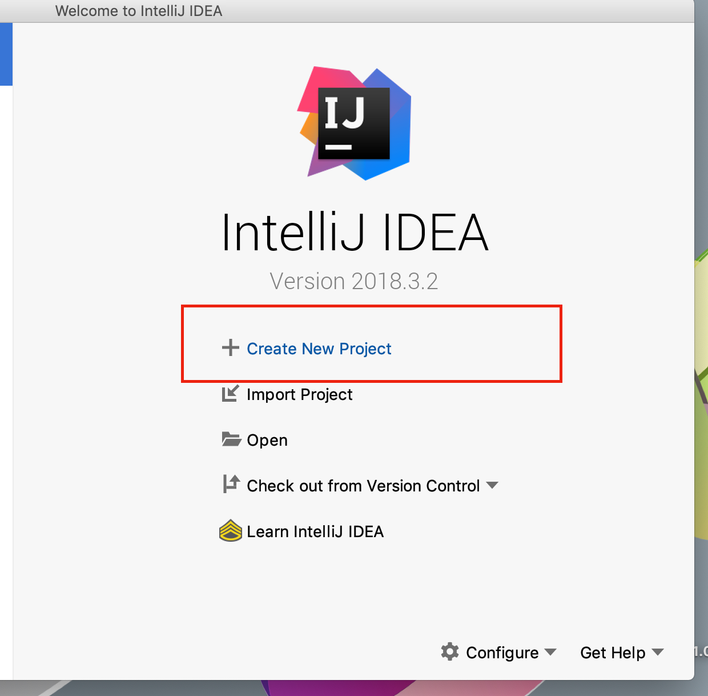
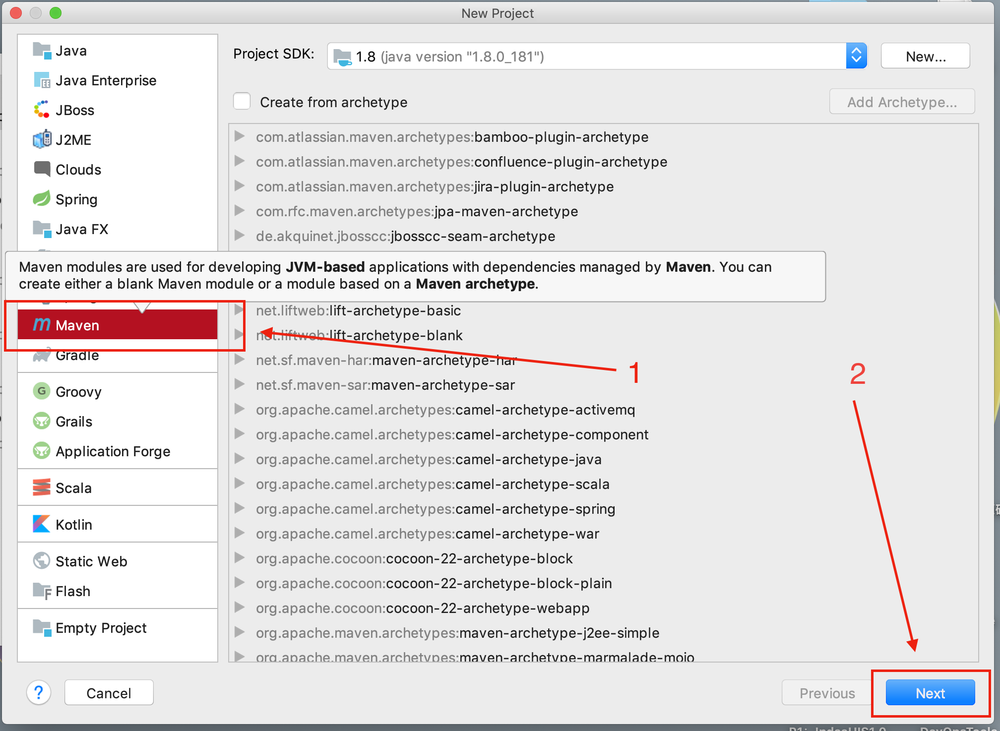
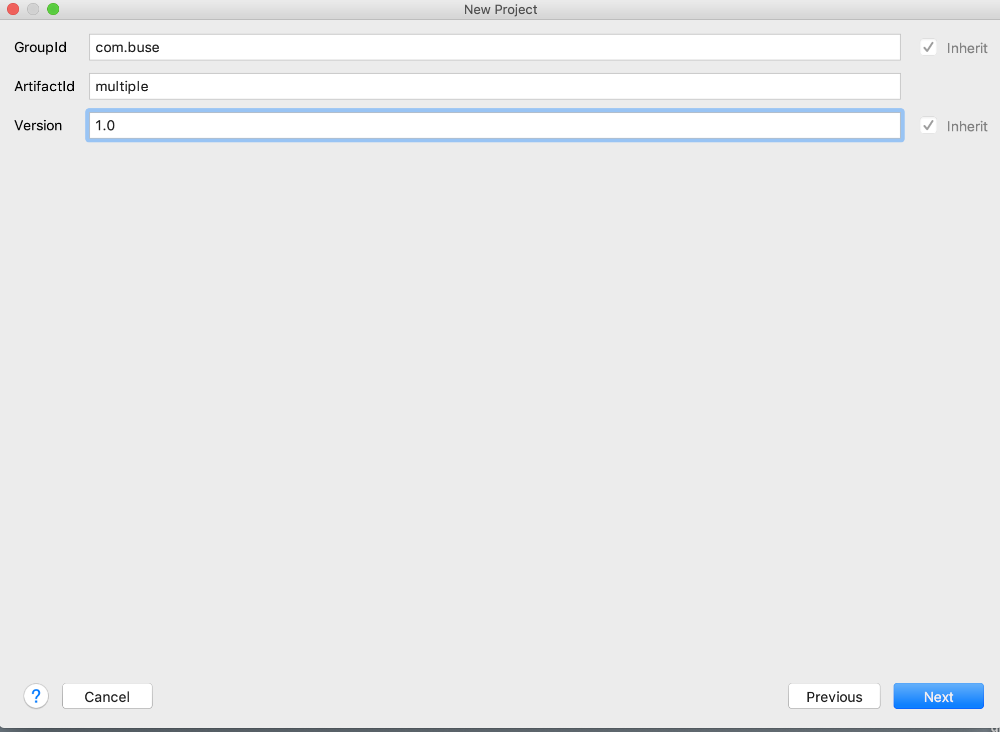
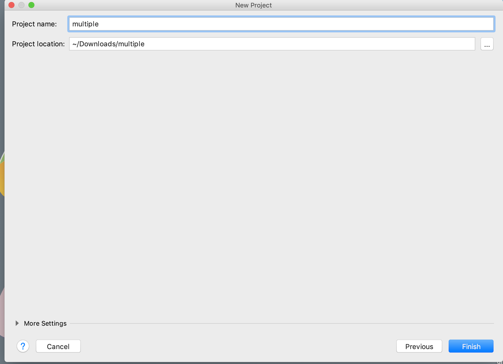
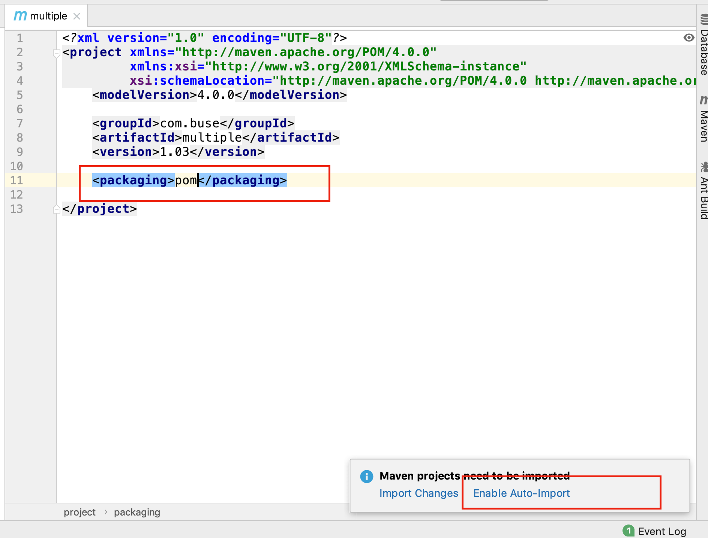
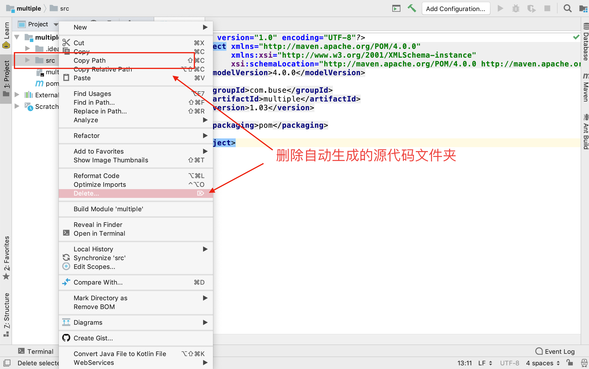
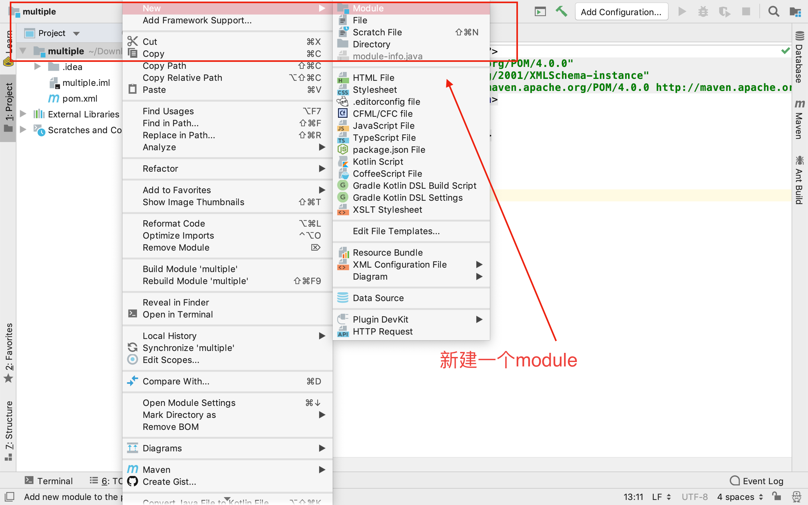
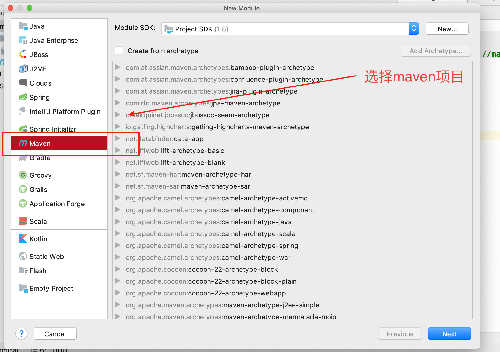
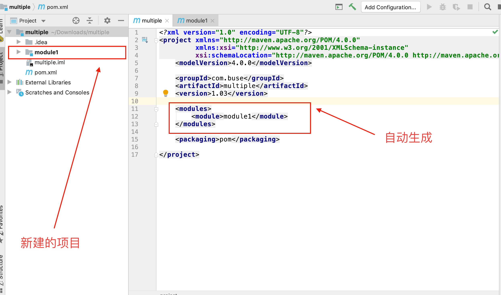

# maven多项目环境搭建

1. idea建立maven多项目环境

   

   

   

   

   

   

   

   

   

#### 参考资料

* [idea spring boot多项目](https://www.youtube.com/watch?v=yVzi3wuTUE4)
* [eclipse多项目环境搭建](https://www.cnblogs.com/h--d/p/6001366.html)
