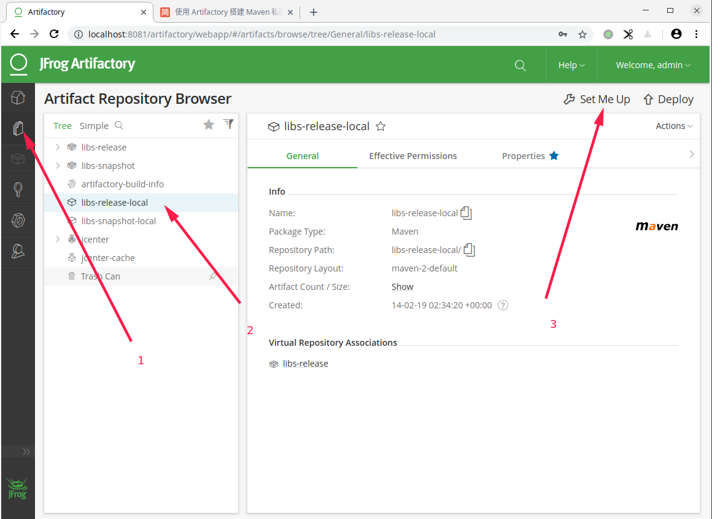
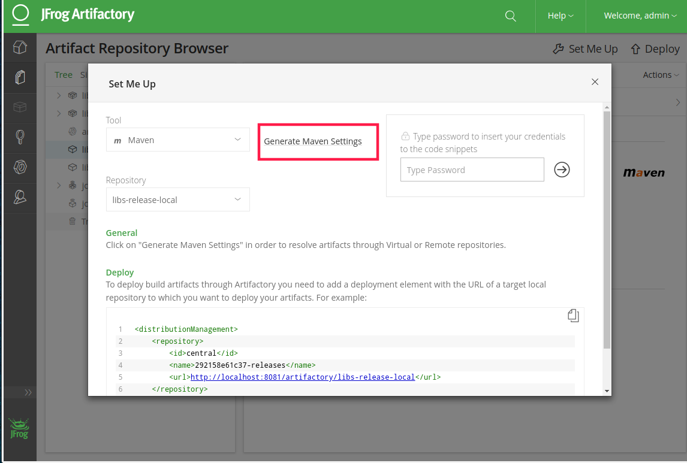
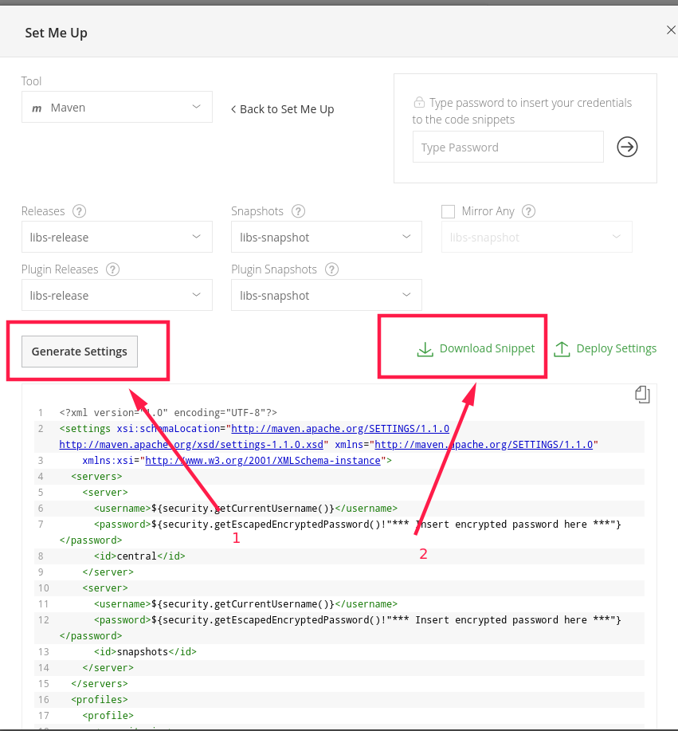
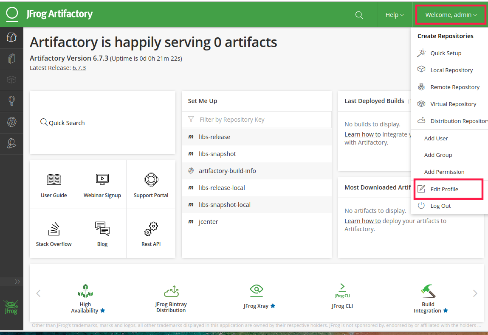
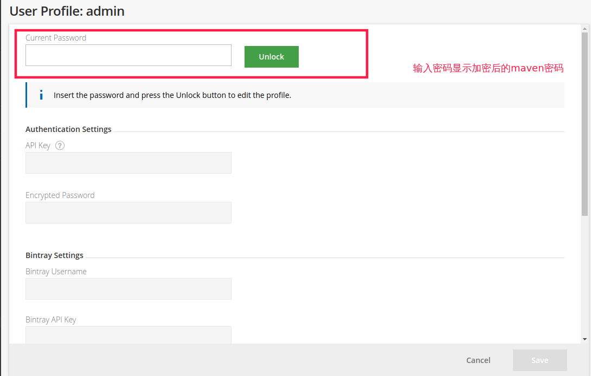
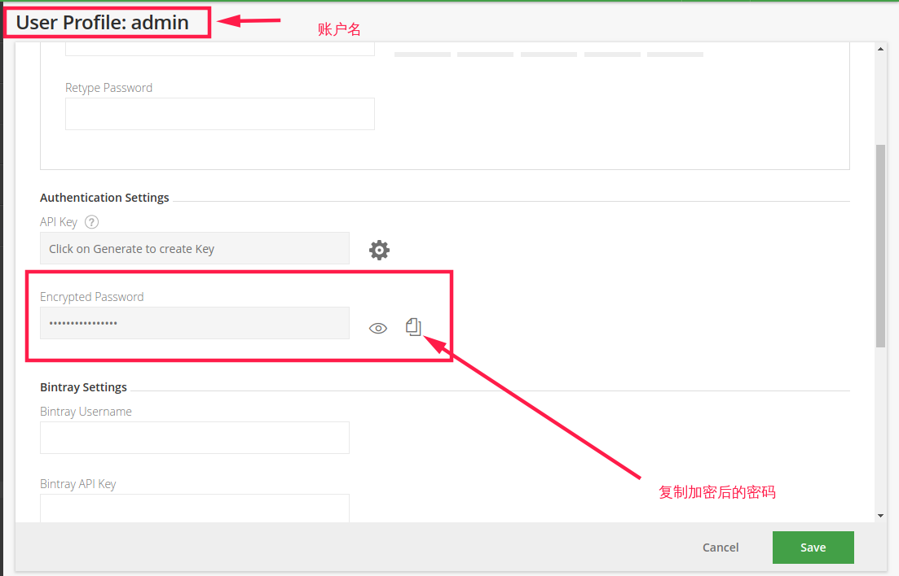
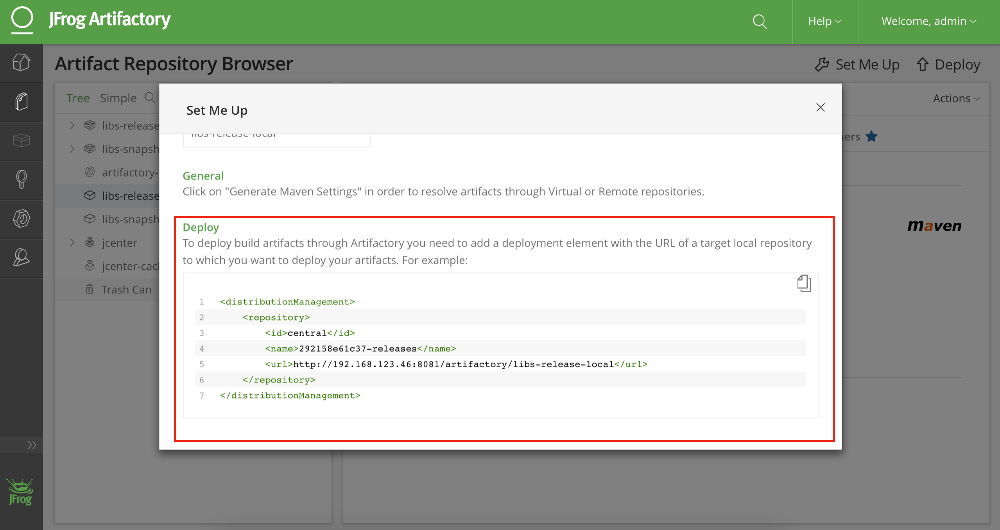
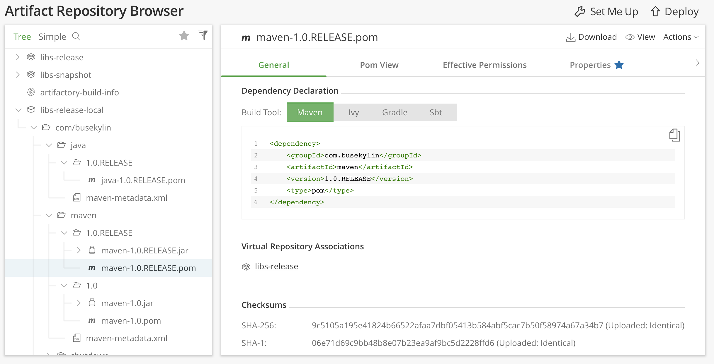

# 配置maven私服

1. maven私服选择[artifactory](https://www.jfrog.com/confluence/)

   Artifactory支持多种语言的包依赖管理，这里我们把它当作java的maven包依赖管理

2. 安装Artifactory

   服务器上先安装好docker环境，然后下载Artifactory的docker文件

   ```shell
   docker pull docker.bintray.io/jfrog/artifactory-oss:latest
   
   # 查看是否下载成功
   docker images
   ```

3. 启动Artifactory

   1. 先创建容器卷使得数据保存在宿主机上

      ```shell
      docker volume create artifactory  # 创建名字为artifactory的容器卷
      
      docker volume inspect artifactory # 查看该容器卷的信息
      ```

   2. 启动容器

      ```shell
      docker run --name artifactory-oss -d -v artifactory:/var/opt/jfrog/artifactory -p 8081:8081 docker.bintray.io/jfrog/artifactory-oss:latest
      ```

   3. 配置artifactory仓库

      打开网页http://localhost:8081 ,等待启动完成后在`Create Repositories`中选择maven，点击create完成

4. 使用artifactory仓库

   1. 获取 Artifactory 自动生成的配置文件，并下载到本地

      

   2. 生成maven配置文件

      

      

      3. 修改`settings.xml`文件的内容

         * 先在Artifactory中查看账户名和加密后的密码

           

           

           

         * 修改下载的`settings.xml`文件的内容

           1. `username`改为`User Profile`显示的名字

           2. `password`改为复制的加密后的内容

           3. 修改`localhost`为 Artifactory容器运行的宿主机IP地址

              ```shell
              ifconfig
              ```

           4. 添加阿里云镜像地址

              ```xml
              <mirrors>
              	<mirror>
              		<id>alimaven</id>
              		<name>aliyun maven</name>
              		<url>http://maven.aliyun.com/nexus/content/groups/public/</url>
              		<mirrorOf>central</mirrorOf>
              	</mirror>
              </mirrors>
              ```

           修改后的[settings.xml](./file/settings.xml)文件

         * 拷贝此`settings.xml`文件到需要此仓库的主机的`~/.m2/`目录中

           ```shell
           cp settings.xml ~/.m2/
           ```

      4. 在项目中使用私服

         1. 在项目的`pom.xml`文件中添加如下代码：

            ```xml
            <distributionManagement>
            	<repository>
            		<id>central</id>
            		<name>292158e61c37-releases</name>
            		<url>http://192.168.123.46:8081/artifactory/libs-release-local</url>
            	</repository>
            </distributionManagement>
            ```

            **在Artifactory 管理页面中可以获得此distributionManagement**

            

         2. 执行命令发布

            ```shell
            mvn clean deploy
            ```

            >**注意**：发布的正式版本中必须在version字段中包含RELEASE关键字，快照版中必须包含SNAPSHOT关键字。
            >
            >如：
            >
            >```xml
            ><version>1.0.RELEASE</version>
            >```

         3. 查看发布依赖

            

#### 参考资料

* [使用 Artifactory 搭建 Maven 私服](https://www.jianshu.com/p/dfd02fa239e2)